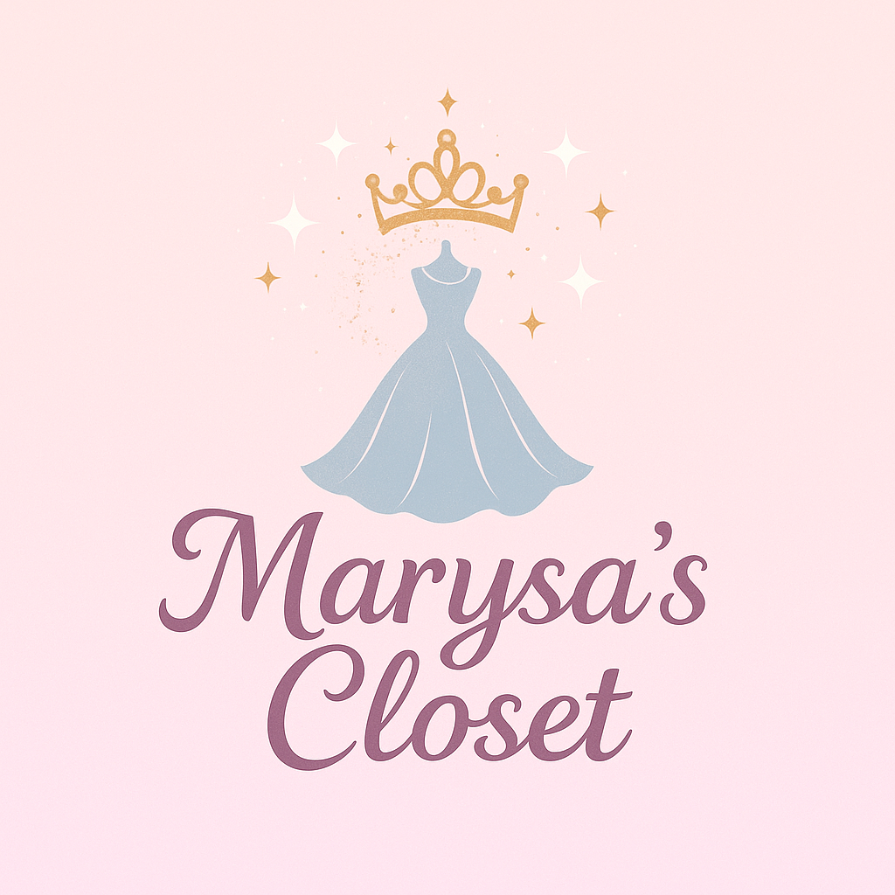
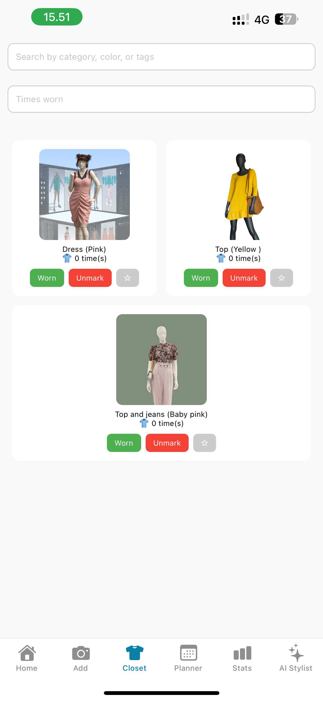
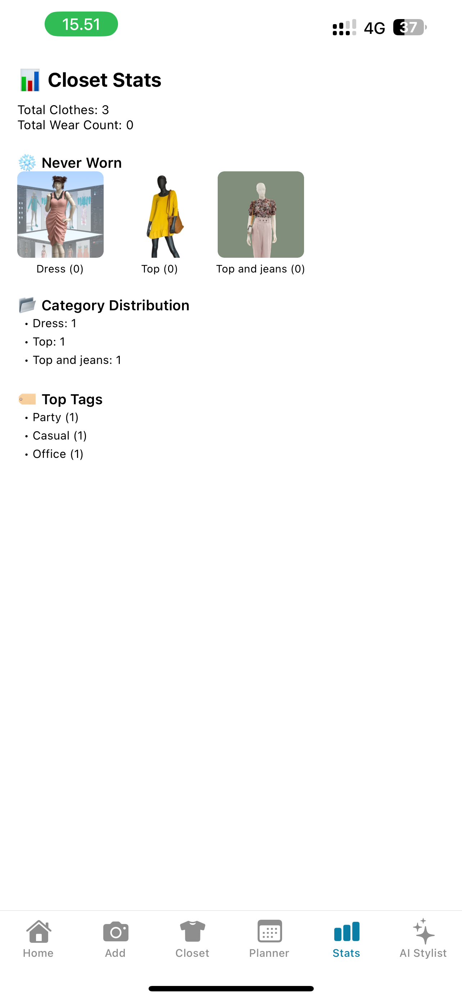

# 👗 Marysa’s Closet

A beautiful, lightweight personal wardrobe management app built with **React Native + Expo**. Designed to help users manage their closet, track wears, plan outfits weekly, and stay organized — all from their phone.



---

## ✨ Features

### ✅ Closet Management
- Add clothes with:
  - 📸 Camera or 🖼️ Gallery
  - Category, color, and tags
  - Multiple image upload (max 3)
- Mark items as 👕 Worn or ❌ Unmark
- Delete clothes with long press
- Zoom into images with pinch gestures
- Preview images full-screen
- Mark favorites ❤️ — favorites always appear on top

### 🔍 Smart Filtering + Search
- Search bar for **category + color + tags**
  - e.g., "red dress", "blue shirt"
- Dropdown for filtering by **wear count**
- Clear ❌ filters button
- Applied filters preview bar

### 🗓️ Weekly Outfit Planner
- Interactive calendar view (📅)
- Tap a date to assign multiple outfits
- Planned dates show a dot 🔵 in calendar
- Easily remove items from a day's plan
- Persisted using AsyncStorage

### 📊 Stats Dashboard
- Total items
- Most worn 🔥
- Least worn 🧼
- Never worn ❄️
- Visual previews of top 5 items per category

### 🌟 AI Stylist (Coming Soon)
- Placeholder screen with "Coming Soon" tag for future integration

---

## 📸 Screenshots

| Closet Tab | Plan Week | Stats |
|------------|-----------|-------|
|  |  |  |

---

## 🛠️ Technologies Used

- React Native + Expo
- `expo-image-picker`
- `react-native-reanimated` + `gesture-handler`
- `@react-native-async-storage/async-storage`
- `react-native-safe-area-context`
- `react-native-calendars`
- `react-native-picker-select`

---

## 📂 Project Structure

```
marysas-closet/
│
├── app/                   # Main app screens
│   ├── (tabs)/            # Tab navigation pages
│   ├── ai-stylist.js
│   ├── add-clothes.js
│   ├── closet.js
│   ├── plan-week.js
│   ├── stats.js
│   ├── home.js
│
├── assets/                # Fonts, images, icons
│
├── components/            # Reusable components
│
├── constants/             # Theme & Colors
│
├── hooks/                 # Theme / Color Scheme
│
├── .gitignore
├── package.json
├── README.md

```

---

## 📱 Installation & Run

### 1. Clone the repo

```bash
git clone https://github.com/tanviiiiir-r/marysas-closet.git
cd marysas-closet
```

### 2. Install dependencies

```bash
npm install
```

### 3. Start development server

```bash
npx expo start
```

> 📲 Scan the QR code using **Expo Go** app on your iOS/Android device.

---

## 📥 .gitignore

```gitignore
# dependencies
/node_modules

# builds
/dist
/build
.expo
.expo-shared

# system files
.DS_Store
.env
```

---

## 👤 Author

**Md Tanvir Rana**  
🧠 [@tanviiiir_r](https://github.com/tanviiiir_r)  
🧵 Built with ❤️ for Marysa

---

## 📌 License

This project is licensed under the MIT License. See `LICENSE.md` for more details.
